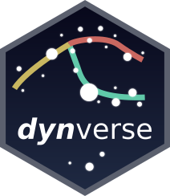

<!-- README.md is generated from README.Rmd. Please edit that file -->
dynverse 
===========================================================================

**dynverse** is a collection of R packages aimed at supporting the trajectory inference (TI) community on multiple levels: end-users who want to apply TI on their dataset of interest, and developers who seek to easily quantify the performance of their TI method and compare it to other TI methods.

All of these packages were developed as part of a benchmarking study available on [bioRxiv](https://doi.org/10.1101/276907). All source code has been made available [here](https://github.com/dynverse/dynalysis).

Wouter Saelens\*, Robrecht Cannoodt\*, Helena Todorov, Yvan Saeys. “A comparison of single-cell trajectory inference methods: towards more accurate and robust tools”. bioRxiv (Mar. 2018). DOI: [10.1101/276907](https://doi.org/10.1101/276907).

\*: Equal contribution

End-users
---------

The **[dyno](https://github.com/dynverse/dyno)** package offers **end-users** a complete TI pipeline. It features:

-   a uniform interface to 50 [TI methods](https://github.com/dynverse/dynmethods#list-of-included-methods),
-   an [interactive guideline tool](https://github.com/dynverse/dyno#selecting-the-most-optimal-ti-methods) to help the user select the most appropriate method,
-   the [interpretation and visualisation of trajectories](https://github.com/dynverse/dyno#plotting-the-trajectory), including colouring by gene expression or clusters, and
-   downstream analyses such as the [identification of potential marker genes](https://github.com/dynverse/dyno#plotting-relevant-features).

Developers
----------

For developers of existing or new TI methods, **dyno** offers the same features as to end-users. In addition, developers might also want to check out the following packages:

-   **[dynmethods](https://github.com/dynverse/dynmethods)**, which is a repository of wrappers for TI methods. If your method has already been included in dynmethods, an [issue](https://github.com/dynverse/dynmethods/issues) will have been created there.
-   **[dynwrap](https://github.com/dynverse/dynwrap)**, the wrapping functions for transforming common trajectory data formats into the common trajectory model supported by dynverse.
-   **[dyneval](https://github.com/dynverse/dyneval)**, the metrics for evaluating and comparing trajectories.
-   **[dynalysis](https://github.com/dynverse/dynalysis)**, all source code in order to replicate the benchmarking study by Saelens and Cannoodt ([10.1101/276907](https://doi.org/10.1101/276907)).

Overview
--------

dynverse consists of several subpackages:

| Package                                                    | Status                                                                                                                          | Code coverage                                                                                                                          | Description                               |
|:-----------------------------------------------------------|:--------------------------------------------------------------------------------------------------------------------------------|:---------------------------------------------------------------------------------------------------------------------------------------|:------------------------------------------|
| [dynalysis](https://github.com/dynverse/dynalysis)         |          |          | Scripts to reproduce manuscript           |
| [dynwrap](https://github.com/dynverse/dynwrap)             |              |              | Common trajectory wrapping functionality  |
| [dynmethods](https://github.com/dynverse/dynmethods)       |        |        | Wrappers for trajectory inference methods |
| [dyneval](https://github.com/dynverse/dyneval)             |              |              | Metrics and evaluation pipeline           |
| [dyngen](https://github.com/dynverse/dyngen)               |                |                | Generator of synthetic datasets           |
| [dynnormaliser](https://github.com/dynverse/dynnormaliser) |  |  | Common normalisation functionality        |
| [dyntoy](https://github.com/dynverse/dyntoy)               |                |                | Quick generator of small toy datasets     |
| [dynplot](https://github.com/dynverse/dynplot)             |              |              | Common visualisation functionality        |
| [dynutils](https://github.com/dynverse/dynutils)           |            |            | Various common functions                  |
